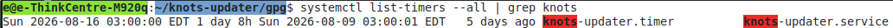
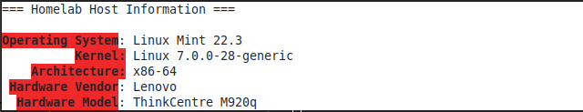
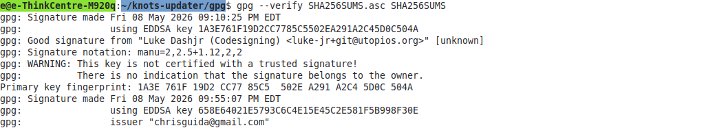
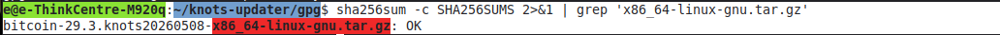
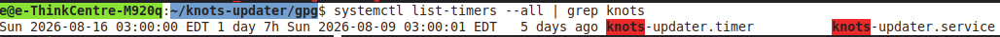
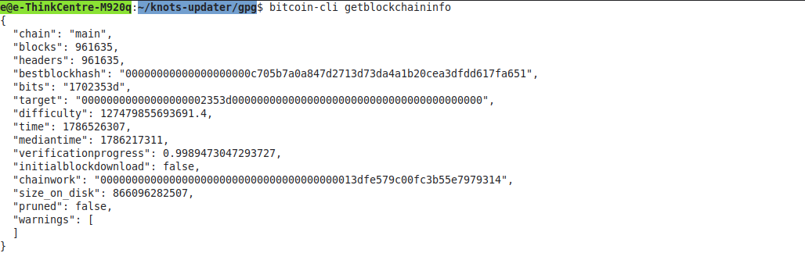

# Bitcoin Knots Verified Update Automation

## Overview

Built a verified update workflow for a self-hosted Bitcoin Knots full node running on Linux.

The project automates the process of checking for new Bitcoin Knots releases, verifying release signatures and SHA-256 checksums, backing up the existing binaries, installing the verified release, and restarting the Bitcoin node.

The update process is scheduled through systemd.

## Environment

- Linux Mint 22.3
- x86-64
- Lenovo ThinkCentre M920q
- Bitcoin Knots
- Bash
- GnuPG / OpenPGP
- SHA-256
- systemd
- systemd timers
- curl
- wget

## Security Verification

Before installing an update, the script performs multiple verification steps.

### GPG Signature Verification

The Bitcoin Knots release checksum file is verified using the trusted Luke Dashjr codesigning key.

Trusted key fingerprint:

1A3E 761F 19D2 CC77 85C5 502E A291 A2C4 5D0C 504A

### SHA-256 Verification

The downloaded release archive is checked against the official SHA-256 checksum.

The update process does not install the binary unless the verification steps succeed.

## Automated Update Workflow

The updater:

1. Checks for the latest Bitcoin Knots release
2. Compares it with the installed version
3. Downloads the release files
4. Verifies the GPG signature
5. Verifies the SHA-256 checksum
6. Creates a backup of the existing binaries
7. Stops the Bitcoin service
8. Installs the verified binaries
9. Restarts the Bitcoin service
10. Verifies that the service is running

## systemd Automation

The updater runs automatically using a weekly systemd timer.

The workflow is:

knots-updater.timer
        |
        v
knots-updater.service
        |
        v
update.sh
        |
        +--> Check release
        +--> GPG verification
        +--> SHA-256 verification
        +--> Backup
        +--> Install
        +--> Restart Bitcoin Knots
        +--> Verify service health

## Project Evidence

### Bitcoin Node Information

### Node Health

### Node Verification

### SHA-256 Verification

### systemd Automation

### Blockchain Information

## Skills Demonstrated

- Linux system administration
- Bash scripting
- Software integrity verification
- GPG / OpenPGP
- SHA-256 checksums
- systemd services
- systemd timers
- Backup and recovery procedures
- Automated software deployment
- Service health verification
- Technical documentation
