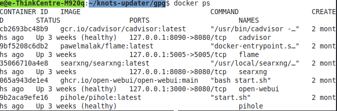
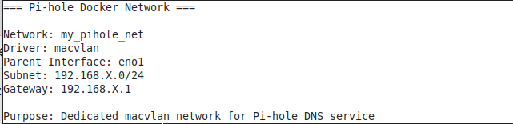
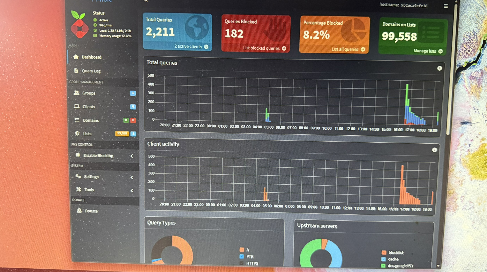
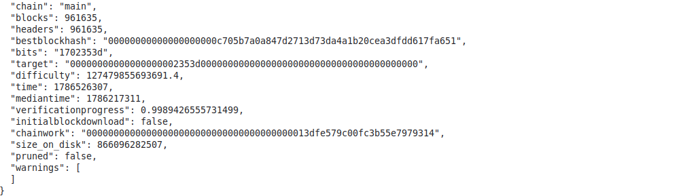

# Self-Hosted Linux Homelab

## Overview

Built and maintain a self-hosted Linux homelab on a Lenovo ThinkCentre M920q running Linux Mint 22.3.

The system is used as a personal infrastructure platform for experimenting with Linux administration, Docker, networking, self-hosted applications, monitoring, and Bitcoin infrastructure.

## Infrastructure

### Host

- Lenovo ThinkCentre M920q
- Linux Mint 22.3
- Linux kernel 7.0.0-28-generic
- x86-64
- 1.8 TB NVMe storage
- 8 GB RAM

## Containerized Services

The host currently runs several Docker containers:

| Service | Purpose | Status |
|---|---|---|
| Pi-hole | DNS and network-level filtering | Healthy |
| SearXNG | Self-hosted metasearch engine | Running |
| Open WebUI | Self-hosted AI web interface | Healthy |
| Flame | Homelab dashboard | Running |
| cAdvisor | Container monitoring | Healthy |

## Docker Networking

The environment uses multiple Docker networking modes.

### Default Bridge Network

Several application containers currently operate on Docker's default bridge network.

Services include:

- Flame
- SearXNG
- Open WebUI
- cAdvisor

Published ports are bound to localhost where appropriate rather than exposing the services directly to the network.

### Macvlan Network

Pi-hole uses a dedicated Docker macvlan network:

```text
Docker Host
    |
    +-- eno1
          |
          +-- macvlan
                |
                +-- Pi-hole
                    192.168.1.250

---

## Project Evidence

### Docker Infrastructure


### Pi-hole


### Pi-hole Dashboard


### Homelab Dashboard


### Open WebUI

